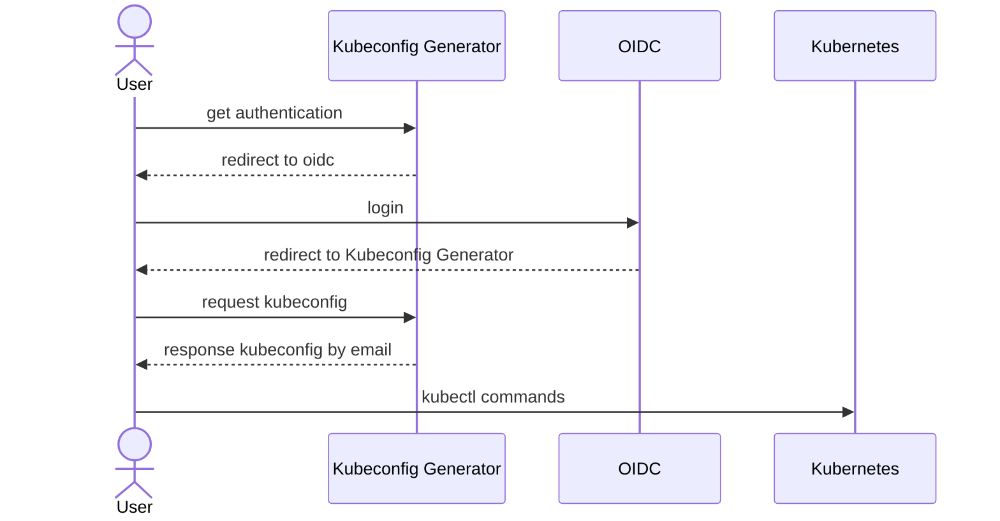

# kubeconfig-generator
The simplest form of kubeconfig generator using OIDC



Access the page, log in to IdP, and paste the received command into the shell.

## Configuration

### `config.yaml` Spec
```
flask_secret_key: # FLASK_SECRET_KEY
oidc:
  issuer: # IdP Issuer (e.g https://accounts.google.com)
  redirect_uri: # Callback URL (e.g https://my.domain.com/callback)
  client_id: # Client ID (created by IdP)
  client_secret: # Client Secret (created by IdP)
cluster:
  host: # api-server address (e.g 'https://my.domain.com:6443')
  ca: # base64 encoded certificate authority
  name: # cluster name (e.g cluster.local)
```

It should be mounted on `/login-config/config.yaml`

### Kubernetes API Server Arguments
```
--oidc-client-id=<Your-Client-Secret>
--oidc-issuer-url=<IdP-Issuer>
--oidc-username-claim=<Username-Claim> # e.g email
```

### RoleBinding
```
apiVersion: rbac.authorization.k8s.io/v1
kind: RoleBinding
metadata:
  name: my-id-user
  namespace: default
roleRef:
  apiGroup: rbac.authorization.k8s.io
  kind: Role
  name: infrastructure
subjects:
- apiGroup: rbac.authorization.k8s.io
  kind: User
  name: alice@mycompany.com
```

---

For secure authentication, many IdPs only allow redirects to HTTPS. In that case, either provide appropriate certificates to flask or use a reverse proxy with certificates.
